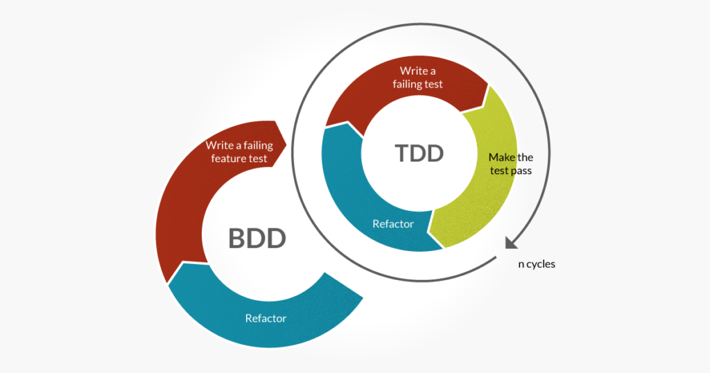

# Behaviour Driven Development

## Definicja
* Behavior-Driven Development (BDD) polega na tworzeniu oprogramowania poprzez opisywanie pewnego zachowania z perspektywy jego użytkowników
* BDD to proces wytwarzania oprogramowania, w którym dokumentacja i testy są pisane w języku naturalnym.  Jest integralną częścią całego cyklu wytwarzania oprogramowania. 
* Funkcjonalność oprogramowania powinna być opisana w języku **Gherkin** jeszcze na etapie zbierania wymagań i analizy, a następnie wykorzystywana w fazie projektowania i implementacji. 

# TDD vs BDD
* w TDD rozwój oprogramowania opiera się tu na testach napisanych dla jeszcze nieistniejących funkcjonalności, podczas gdy BDD ma na celu wykorzystanie zrozumiałego 
dla wszystkich nawet osób bez wiedzy technicznej języka
* TDD jest dla dewelopera, BDD dla klienta (i/lub analityka, product owner'a)



## Idealny scenariusz współpracy analityka biznesowego oraz dewelopera i/lub testera
Rozpoczynając testy manualne, tester opiera się na istniejącej dokumentacji, która w jasny sposób pokazuje mu warunki początkowe, wszystkie niezbędne akcje i ich finał. 
Następnie na jej podstawie tworzone są testy automatyczne z zachowaniem języka naturalnego. Tester lub deweloper otrzymuje zadanie do przetestowania manualnego/napisania 
testu automatycznego i dzięki czytelnej formie zapisu wie, czym ma się zająć. W teorii, interpretacja zadania nie powinna być problemem.

## Zalety BDD
Odpowiednio skonstruowana dokumentacja:

````gherkin
Scenario: User add article
  Given User is logged in
  When User add new article
  Then Article should be displayed
````
wykorzystująca język naturalny, dostępna dla wszystkich członków projektu, może wspierając rozwój aplikacji na różnych etapach. 
Można omawiać ją na spotkaniach przed implementacją oraz w jej trakcie, a następnie wykorzystać w testach automatycznych i raportach. 
Jest przydatna dla osób bez wiedzy technicznej (np. osoba z biznesu), którzy mają wgląd czy zadane ścieżki biznesowe są pokryte przez testy automatyczne, a rozwój aplikacji idzie w dobrą stronę.

[](https://youtu.be/fX2altB4AME)

## Wady i błędy w wykorzystaniu BDD
* Biznes nie dostarcza gotowych scenariuszy w formie „Given, When, Then”
* Scenariusz testów jest tworzony po czasie
* Biznes nie jest zainteresowany treścią testów

## Linki
* [Cucumber](https://cucumber.io/docs/cucumber/)
